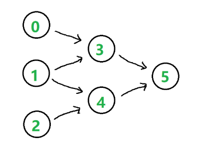

# 课程表 II  
leetcode👉https://leetcode-cn.com/problems/course-schedule-ii/  

现在你总共有 n 门课需要选，记为 0 到 n-1  
在选修某些课程之前需要一些先修课程。例如，想要学习课程 0，你需要先完成课程 1，我们用一个匹配来表示他们: [0,1]  
给定课程总量以及它们的先决条件，返回你为了学完所有课程所安排的学习顺序  
可能会有多个正确的顺序，你只要返回一种就可以了。如果不可能完成所有课程，返回一个空数组  
```js
示例 1:
输入: 2, [[1,0]] 
输出: [0,1]
解释: 总共有 2 门课程。要学习课程 1，你需要先完成课程 0。因此，正确的课程顺序为 [0,1]

示例 2:
输入: 4, [[1,0],[2,0],[3,1],[3,2]]
输出: [0,1,2,3] or [0,2,1,3]
解释: 总共有 4 门课程。要学习课程 3，你应该先完成课程 1 和课程 2。并且课程 1 和课程 2 都应该排在课程 0 之后。
因此，一个正确的课程顺序是 [0,1,2,3] 。另一个正确的排序是 [0,2,1,3]
```

- 分析  
  1. 一共有 n 门课程要上，编号为  0 ~ n-1  
  2. 先决条件数组，例如 [1, 0] -> 要先上完课程 0 才能上课程 1  
  3. 给一个 n 和所有的先决条件，返回一种可以上完课程的排序  
  数组中的数据存在依赖关系，根据依赖关系进行排序  

- 使用有向图表示依赖关系  
  n = 6, 先决条件: [[3, 0], [3, 1], [4, 1], [4, 2], [5, 3], [5, 4]]  
  1. 先上 0 和 1 才能上 3  
  2. 先上 1 和 2 才能上 4  
  3. 先上 3 和 4 才能上 5  
  

  0、1、2 在有向图中 入度为 0(以它为终点的元素个数为 0)  
  3、4、5 的入度都为 2  

- 选课的标准  
  每次只能选入度为 0 的课程，选择了之后将这门课程从图中去除，比如选择了课程 0 之后将该课程从图中去除  
  去除之后依赖 0 的课程入度发生改变，例如去除课程 0 之后课程 3 的入度从 2 变为 1  
  然后再选择 1 -> 去除 1 -> 3 的入度变为 0，4 的入度变为 1  
  选择课程 2 -> 去除 2 -> 4 的入度变为 0  
  选择课程 3。。。 -> 选择课程 4  

  最终课程 5 的入度变为 0 -> 得到最终上完课程的顺序  

- 引入 BFS  
  1. 先让入度为 0 的课程进入 queue  
  2. 然后依次选择课程，出队，相关课程入度发生变化  
  3. 再让新的入度为 0 的课程进入 queue  
  重复 1 - 3 直到没有入度为 0 的可选课程为止  

- 关心的问题  
  1. 每门课程的入度  
  2. 课程之间的关系 -> 每门课程的后续课程  

- 入度数组  
  1. 每门课的入度都是动态变化的  
  2. 课程编号为 0 ~ n-1，用一维数组存放入度  
  3. 遍历给定的先决条件数组，计算每门课初始的入度  

- 课程之间的关系 -> 标记每门课程的后续课程  
  使用哈希表键值对存储门课程的后续课程  
  键：课程的编号  
  值：依赖键的后续课程 -> 用数组表示  
  举例：先上 0 才能上 3 和 5  
    0: [3, 5]  

- 总体思路  
  1. 构建一个队列 queue，queue 中始终存放入度为 0 的课程，queue 是动态变化的  
  2. 每选择一门课(入度为 0)，就从 queue 中出队，同时查找哈希表中该课程对应的后续课程  
  3. 将对应的后续课程的入度 -1，如果减完之后入度为 0，将该课程加入 queue 中  
  4. 如果所有课程选择完毕，queue 为空，退出循环  
